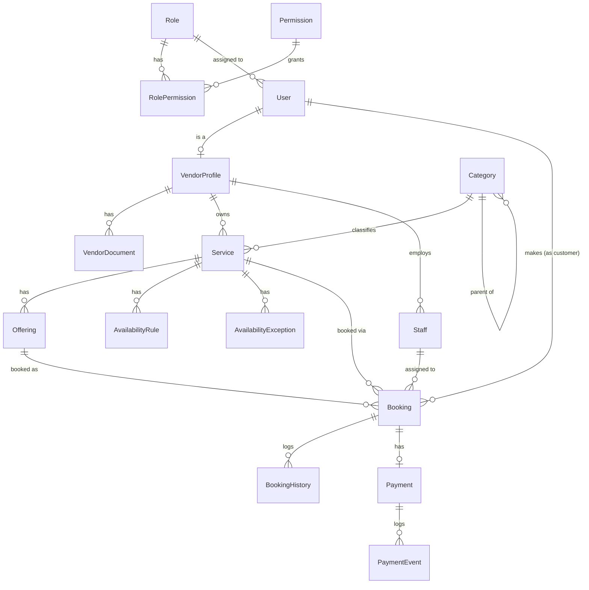

# Key Architecture & Engineering Decisions (`DECISIONS.md`)

This document records the core design decisions, data model, concurrency strategy, and intentional trade-offs made during the development of the Services Marketplace system.

---

## 1. System Architecture & Domain Model

The application uses a 3-tier decoupled monorepo layout consisting of NestJS (`apps/api`) and Next.js 15 App Router (`apps/web`), backed by PostgreSQL via Prisma ORM.

### Entity Relationship Diagram

---

## 2. Concurrency Control & Capacity Race Prevention

To ensure that bookable slots are strictly derived on-demand and cannot be overbooked during simultaneous requests, slot capacity enforcement uses **PostgreSQL Transaction-Scoped Advisory Locks** (`pg_advisory_xact_lock`):

1. **Lock Key Generation:** Every booking creation and reschedule request generates an integer hash from `serviceId + offeringId + slotStart.toISOString()`.
2. **Atomic Lock Acquisition:** Inside a Prisma `$transaction`, `pg_advisory_xact_lock(hashtext(key))` is called prior to slot validation.
3. **Sequential Slot Derivation:** This serializes concurrent booking requests targeting the exact same slot while allowing unrelated slots/services to proceed without lock contention.
4. **Live Count Check:** Active bookings (`PENDING`, `CONFIRMED`, `COMPLETED`) are counted against the derived slot capacity. If `count < capacity`, the booking and history entry are inserted atomically; otherwise, the transaction aborts with `409 Conflict`.

---

## 3. Data-Driven Permission & Authorization Engine

- **Real-Time Guard Evaluation:** `PermissionsGuard` evaluates the current user's role permissions directly from the database on every request (never cached in access tokens). Revoking a permission in the database takes effect immediately on the next request.
- **Ownership vs. Permission Separation:** Missing permission slug returns `403 Forbidden`. Attempting to access another user's private resource (e.g. customer A reading customer B's booking) returns `404 Not Found` to prevent resource enumeration.
- **Bypass Checks:** Roles marked with `bypassChecks = true` (`SUPER_ADMIN`) short-circuit permission checks.

---

## 4. Payment Integration Architecture

- **Abstracted Provider Interface:** Payment interactions are encapsulated behind a `PaymentProvider` interface and injected via NestJS DI (`MockPaymentProvider`), enabling seamless replacement with a production gateway (e.g., Stripe/Razorpay) without modifying core business logic.
- **Idempotency:** Payment endpoints enforce `Idempotency-Key` headers via an `IdempotencyInterceptor`, persisting and replaying exact HTTP response envelopes for duplicate invocations.
- **Mock Token Triggers:** Allows deterministic simulation of success (`tok_success`), failure (`tok_fail`), and delayed webhook settlement (`tok_delay`).

---

## 5. Deliberate Omissions & Out-of-Scope Items

Per the system design specification (`IMPLEMENTATION_PLAN.md` Section 6):

1. **Forgot-Password Workflow:** Intentionally omitted. Authentication is strictly handled via direct email/password credential verification and token rotation.
2. **Object Storage Service:** Stored filenames and metadata (`VendorDocument.filename`, `Service.images`) are persisted in PostgreSQL. A local multer upload endpoint exists for development, avoiding production reliance on ephemeral server disks.
3. **Redis / External Queue:** Eliminated infrastructure overhead by utilizing Postgres advisory locks and single-query database checks.

---

## 6. Future Enhancements (Given Additional Engineering Time)

1. **Expiring Password Reset Flow:** Implement email delivery with single-use, timed reset tokens.
2. **Cloud Object Storage:** Integrate AWS S3 or UploadThing for direct image/document upload signed URLs.
3. **Queue-Backed Webhooks:** Introduce BullMQ + Redis for asynchronous payment retries, webhook deliveries, and background notifications.
4. **Interactive Staff Schedule Management:** Provide visual UI tools for vendors to assign individual staff members to custom weekly shift patterns.
